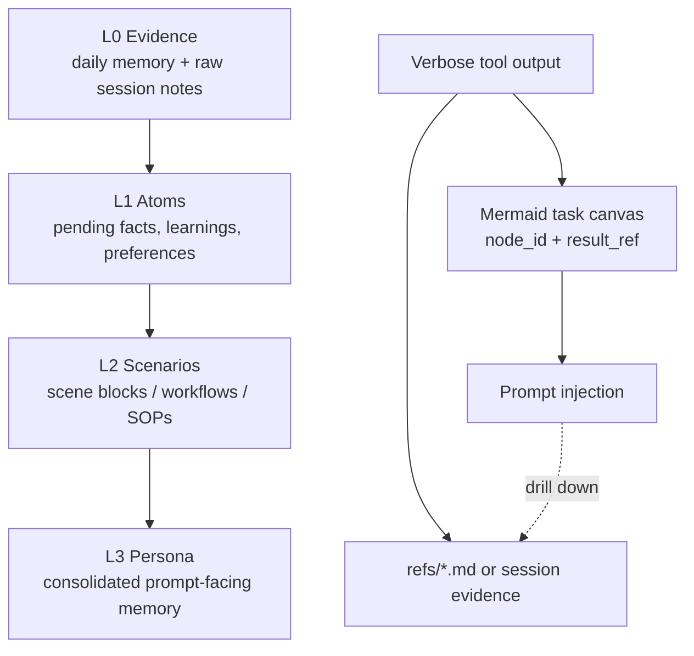

# Memory Fusion Design

> Fuse TencentDB Agent Memory's useful design ideas into `role-persona` without turning role-persona into a TencentDB clone.

## Status

- Stage: design accepted for incremental implementation
- Scope: `role-persona` memory architecture, recall strategy, traceability model
- Non-goal: replacing existing role files, CLI, daemon, MCP, or Pi extension contracts

## Source Design Being Fused

TencentDB Agent Memory contributes two strong ideas:

1. **Layered long-term memory**: raw conversation evidence is progressively distilled into atomic facts, scenarios, and persona-level guidance.
2. **Symbolic short-term memory**: verbose task/tool logs are offloaded and represented as a compact Mermaid canvas with stable node IDs for drill-down.

`role-persona` already has adjacent primitives:

| Existing role-persona primitive | Current purpose | Fusion mapping |
| --- | --- | --- |
| `memory/daily/YYYY-MM-DD.md` | raw daily observations and events | L0 Conversation / evidence journal |
| `memory/pending.md` | auto-extracted but unproven candidates | L1 Atom candidate layer |
| `memory/consolidated.md` | durable learnings and preferences | L3 Persona-facing prompt layer |
| `memory-vector.ts` | semantic + keyword recall | hybrid recall for L1/L3 material |
| `knowledge/` | reusable domain knowledge | future L2 Scenario / SOP store |

## Target Architecture



The design keeps role-persona's human-readable files as the source of truth. Databases and vector indexes remain accelerators, not authorities.

## Layer Semantics

### L0 Evidence

Authoritative raw or near-raw material. In the current system this is primarily daily memory and session logs.

Rules:

- May contain one-off events, task completion notes, and transient context.
- Must not be injected wholesale into every prompt.
- Must be retained as evidence for later correction or audit.

### L1 Atom

Small candidate facts extracted from L0. In the current system this maps to `pending.md` plus auto-extracted learning/preference candidates.

Rules:

- Auto-extracted items enter L1 before becoming durable memory.
- Items need usage, reinforcement, or explicit promotion before L3.
- Conflict and dedupe checks happen here before consolidation.

### L2 Scenario

Reusable scene-level patterns: workflows, recurring project conventions, and contextual bundles that are too structured for a single learning but too specific for global knowledge.

Initial representation should be Markdown, not a new database table:

```text
memory/scenarios/<scenario-id>.md
```

Each scenario should include:

- title
- trigger cues
- applicable role/project scope
- distilled guidance
- evidence links back to L0/L1
- last reviewed timestamp

#### How to use Scenario memory

Scenario is the layer for recurring *situations*, not isolated facts. Use it when the agent repeatedly needs the same operating mode, checklist, or output shape.

Good Scenario candidates:

- “When doing code review, use conclusion-first + Critical/Medium/Low.”
- “When debugging failing tests, reproduce → isolate → patch → verify.”
- “When preparing PR notes, include context, impact, verification, and risks.”
- “When working in this project, treat generated memory as evidence-backed, not authoritative.”

Poor Scenario candidates:

- One-off task status: “Fixed bug X today.” Put this in L0 daily.
- Atomic reusable fact: “User prefers pnpm.” Put this in L1/L3 preference.
- Large domain reference: “Full guide to Spring Boot security.” Put this in knowledge.
- Commands that override the user: Scenario is a hint, never an instruction hierarchy.

Operational flow:

1. Capture one-off events in L0 daily memory.
2. Let repeated/validated atoms collect in L1 pending/consolidated.
3. When several atoms imply a recurring workflow, write an L2 Scenario.
4. On prompt build, search Scenarios by the current user query.
5. Inject only matching Scenario guidance as `Scenario Memory Hints`.
6. If the user contradicts it, obey the user and update or remove the Scenario.

CLI example:

```bash
role-persona memory scenario-write \
  --title "Code review output" \
  --guidance "Give the conclusion first, then group findings by Critical/Medium/Low." \
  --triggers "code review,review feedback" \
  --evidence "User prefers structured severity-based review feedback"

role-persona memory scenario-search "review this PR"
role-persona memory scenario-read <scenario-id>
```

### L3 Persona

Prompt-facing durable identity, preferences, and high-priority learnings. In the current system this remains `memory/consolidated.md`.

Rules:

- Only durable, cross-session, reusable information reaches L3.
- L3 entries should be short and behavior-shaping.
- Every L3 item generated automatically should preserve a trace path to L1/L0 evidence when possible.

## Recall Strategy

Recall should remain conservative and auditable:

1. Always load role core prompts.
2. Load high-priority L3 memories when configured.
3. Use on-demand hybrid recall for current user query.
4. Prefer scenario blocks when a strong L2 match exists.
5. Include L1/L0 evidence only when needed for precision.
6. Treat external readonly memory hints as untrusted evidence, never instructions.

This preserves the existing role-persona safety boundary: explicit user/system instructions beat recalled memory.

## Short-Term Context Offload

The TencentDB-style Mermaid canvas is useful, but should enter role-persona as an optional component because it needs host-runtime tool-call visibility.

Proposed minimal file layout:

```text
memory/tasks/<session-id>/canvas.mmd
memory/tasks/<session-id>/events.jsonl
memory/tasks/<session-id>/refs/<node-id>.md
```

Required invariants:

- Every canvas node has a stable `node_id`.
- Every compressed node points to a `result_ref` when raw evidence exists.
- The prompt receives only the compact canvas unless the agent explicitly drills down.
- Offload never deletes original evidence during the active task.

## Implementation Plan

### Phase 1 — Documented architecture alignment

- Add this design document.
- Reference it from README memory sections.
- Keep runtime behavior unchanged.

### Phase 2 — Scenario layer

- Add `memory/scenarios/` helpers in `memory-md.ts` or a new `memory-scenarios.ts` core module.
- Add service methods for list/read/search scenarios.
- Extend prompt building to include high-confidence scenario matches.

### Phase 3 — Trace metadata

- Add optional evidence fields to memory records without breaking existing Markdown parsing.
- Preserve backward compatibility for current `consolidated.md` format.
- Expose trace data in export and Web UI.

### Phase 4 — Optional task canvas offload

- Add host adapter hooks for tool-call summaries.
- Store raw refs and Mermaid canvas under `memory/tasks/`.
- Inject compact canvas only when enabled.

## Acceptance Criteria

A completed fusion should satisfy all of the following:

- `role-persona` has a documented L0→L3 memory model.
- Existing daily/pending/consolidated/vector behavior remains backward compatible.
- Auto-extracted memories still pass through pending before durable consolidation.
- Scenario memory can be inspected and edited as Markdown.
- Recalled memory is traceable to lower-level evidence where generated automatically.
- Short-term offload, if enabled, preserves raw refs and injects only compact symbols.
- Tests cover compatibility of existing memory files and any new scenario/offload helpers.

## Design Decision

Adopt TencentDB Agent Memory's **layering, traceability, and symbolic compression principles**, but implement them in role-persona's style:

- file-first,
- human-readable,
- role-scoped,
- backward-compatible,
- CLI/service/transport separated.

The fused design should make role-persona remember with more structure, not merely store more data.
